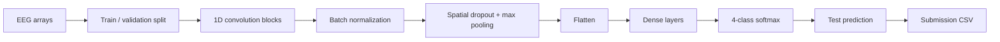

# Motor Imagery EEG Classification with 1D CNN

[](https://www.python.org/)
[](https://www.tensorflow.org/)
[](https://jupyter.org/)


A deep-learning experiment for classifying **motor-imagery EEG signals** into four classes using a **1D convolutional neural network**. The project focuses on learning temporal/channel patterns directly from EEG tensors and includes the workflow for training, validation, test inference, and Kaggle-style submission generation.

## Problem

Motor-imagery brain-computer interfaces aim to infer an intended movement from EEG activity even when no physical movement occurs. EEG is noisy, high-dimensional, and strongly dependent on temporal structure, making representation learning an important part of the classification pipeline.

This notebook explores a 1D-CNN architecture that accepts samples with the original experiment shape **400 × 20** and predicts one of four classes.

## Pipeline



## Model architecture

The notebook uses a sequential TensorFlow/Keras model with:

- Conv1D layers with 32 filters;
- LeakyReLU activations;
- batch normalization;
- spatial dropout for regularization;
- max pooling;
- fully connected layers of 296, 148, and 74 units;
- a four-unit softmax output layer.

The data is split into training and validation sets with an 80/20 split in the original notebook.

| Item | Value in notebook |
|---|---|
| Input shape | 400 × 20 |
| Number of classes | 4 |
| Model family | 1D CNN |
| Validation split | 20% |
| Batch size | 64 |
| Max epochs | 100 |
| Output activation | Softmax |
| Training controls | Model checkpoint + early stopping |

## Repository structure

```text
.
├── Model.ipynb       # Data loading, 1D-CNN training, inference and submission
├── .gitignore
├── .gitattributes
└── README.md
```

## Usage

The original notebook expects NumPy arrays and a Kaggle-style submission template that are **not included** in this repository.

Typical dependencies:

```text
tensorflow
numpy
pandas
scikit-learn
```

Open [`Model.ipynb`](Model.ipynb), provide the expected train/test arrays, adjust paths if required, and execute the workflow in order.

## Evaluation status

The notebook contains validation training logic, but the repository does not currently preserve a reliable final benchmark summary. This README therefore avoids publishing an unsupported accuracy claim.

A stronger evaluation for motor-imagery EEG should report:

- accuracy and macro F1;
- class-wise precision/recall;
- confusion matrix;
- subject-wise or session-wise validation when subject IDs are available;
- repeated or cross-validation results to measure variance.

## Why 1D CNN?

A 1D CNN can learn local patterns along the temporal dimension while sharing filters across a sequence. Compared with a purely dense network, this introduces an inductive bias that is better aligned with time-series structure and can reduce the number of parameters required to discover useful local features.

## Limitations

- Dataset files and class definitions are not included.
- The split strategy shown in the notebook is a random train/validation split; depending on the dataset, a subject-independent split may be more meaningful.
- Signal preprocessing and artifact-removal assumptions are not documented in the repository.
- Final metrics and trained weights are not versioned.
- The code is notebook-centric rather than packaged for reusable inference.

## Potential improvements

1. Document electrode layout, sampling rate, class semantics, and preprocessing.
2. Compare raw-signal CNNs with EEGNet, temporal convolutional networks, and transformer-based baselines.
3. Add subject-wise cross-validation to reduce leakage risk.
4. Track experiments and random seeds.
5. Add explainability such as channel/time attribution.
6. Refactor inference and evaluation into reusable scripts.

## Skills demonstrated

EEG / time-series modeling · 1D CNN · TensorFlow/Keras · validation workflow · multiclass classification · ML experimentation

## License

No explicit open-source license is currently included. Unless a license is added, normal copyright rules apply to the repository contents.
